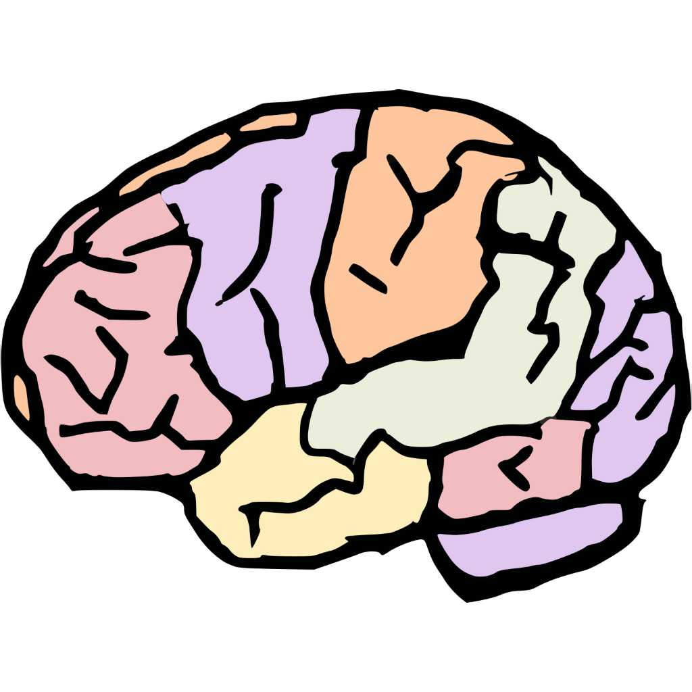

# meme-brain

<p align="center">
  
</p>

A Reddit game where you pick the worst interpretation of a meme.

## How it works

1. You see a meme and a situation
2. Pick one of three deliberately wrong interpretations
3. Get roasted with a personality archetype based on your choice
4. Post your result to the comments

Three game modes rotate per post:

- **Wrong Meaning** — Confidently misread the meme
- **Wrong Tone** — Respond like it's a business email
- **Wrong Framing** — Apply the wrong subreddit worldview

Content is generated per-post using GPT with the meme image as context.

## Stack

- React 19 + Vite + Tailwind CSS 4
- Express 5 serverless backend
- Redis for persistence
- OpenAI GPT for content generation (multimodal)
- Reddit Devvit platform

## Development

```bash
npm install
npm run dev
```

This starts a local dev server with hot reload. You'll need:

- Node 22+
- A Reddit account connected to [developers.reddit.com](https://developers.reddit.com)
- OpenAI API key in your Devvit app settings

## Commands

```bash
npm run dev      # Start development server
npm run build    # Build for production
npm run check    # Type-check + lint + format
npm run deploy   # Upload to Devvit
```

## Project structure

```
src/
├── client/          # React webview
│   ├── components/  # UI components
│   ├── hooks/       # Game state logic
│   └── game/        # Main app entry
├── server/          # Express backend
│   ├── api/         # HTTP endpoints
│   ├── core/        # Game logic, LLM client
│   └── storage/     # Redis operations
└── shared/          # Types shared between client/server
```

## Configuration

Environment variables (set in Devvit app settings):

- `VITE_OPENAI_API_KEY` — OpenAI API key for content generation

Meme sources are configured in `src/server/config.ts`.

## License

MIT
